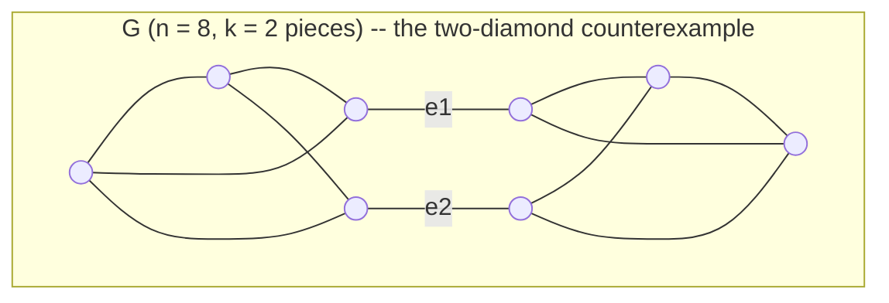

# Admissible bounds for the reduction search

The A* optimality guarantee is only as good as the heuristic's
admissibility. This document derives the bounds, states what is proved
and what is merely machine-certified, and marks the boundary of each.

Notation: `G` is a closed cubic multigraph on `n` vertices; the goal is
the theta graph (`n = 2`). Cost is `#6j + SUM_PENALTY * #sums`, with
`SUM_PENALTY = 10`.

## Lemma 0 (move accounting)

The three moves act on `n` and emit factors as follows:

| move | `n` | 6j | sums |
|---|---|---|---|
| bubble excision | `n - 2` | 0 | 0 |
| triangle contraction | `n - 2` | 1 | 0 |
| interchange (flip) | `n` | 1 | 1 |

**Generalized for the k=1 sector (v0.8.0).** Two more moves remove
vertices for free: loop excision (`n-2`, components unchanged) and
bridge cut (`n-2`, components **+1**). Writing `C` for the number of
components and `X` for the number of bridge cuts, the goal is one
irreducible diagram per component (`n = 2C_final`,
`C_final = C + X`), so the vertex-removing moves number

    (n - 2C - 2X) / 2

For a connected input reduced without bridge cuts (`C = 1`, `X = 0`)
this is the original `(n-2)/2`, which is why every benchmark cost is
unchanged. The rest of this section assumes that case.

Only bubbles and triangles change `n`, each by exactly 2, and the goal
has `n = 2`. So **every** complete reduction of `G` uses exactly
`(n-2)/2` vertex-removing moves, split into `B` bubbles and `T`
triangles, plus `S` flips:

    #6j  = T + S = (n-2)/2 - B + S
    cost = (n-2)/2 - B + (1 + SUM_PENALTY) * S

This identity reproduces all five benchmark costs exactly (tetrahedron
1, prism 2, K3,3 13, cube 14, Petersen 37), and it is what certifies
Petersen below.

**Consequence, and the origin of the v0.6.0 defect.** A lower bound on
cost requires an *upper* bound on `B`. The v0.6.0 heuristic used
`(n-2)/2` as its 6j term, which silently assumes `B = 0`. That is false
in general, so the heuristic was an over-estimate and A* was not
guaranteed optimal — on 58 of 80 reachable states with a computable
optimum (72.5%). See "The counterexamples".

## The shipped heuristic

    h(G) = 0  +  h_sum(G)

**Lemma 1 (summation bound). PROVEN.**

    h_sum(G) = SUM_PENALTY  if n > 2 and girth_lower(G) >= 4, else 0.

*Proof.* If `G` is not the goal and **no vertex-removing move applies**,
then every move out of `G` is an interchange. A complete reduction must
make at least one move, that move is a flip, and a flip emits one
summation. Hence `S >= 1` and `cost >= SUM_PENALTY`. If no move applies
at all, `G` is a dead end, `C*` is infinite, and any `h` is admissible.
∎

**The hypothesis must name every free move.** The move set is
`{bubble excision, loop excision, triangle contraction, interchange}`,
so the test is `bubbles()` **and** `excisable_loops()` **and**
`triangles()` all empty. The k=1 sector added loop excision, and until
`sum_bound` was taught about it the lemma's hypothesis was false at
exactly the tadpole states — charging a summation to a state with a free
vertex-removing move. Adding a free move without updating this test
makes `h` inadmissible in a single release; the two must land in the
same commit. See docs/K1_SECTOR.md, "The coupling".

Note what the proof does **not** use: the girth of `G`. Despite its
name, `girth_lower()` computes no cycle length — it is a
move-availability predicate, and the bound rests only on that.

### Degenerate states, and how the k=1 sector changed them

Before loop excision existed, a tadpole state had flips as its *only*
successors, so it genuinely owed a summation and the bonus was correct
(measured: an `n = 8` instance with `C* = 13 >= 10`). Loop excision
changed that -- such states now have a free vertex-removing move and owe
nothing, which is why `sum_bound` tests `excisable_loops()`.

The remaining degenerate case is the **dumbbell** (two tadpoles joined
by a bridge), where the loop-to-loop guard blocks excision. It is a dead
end today, so any `h` is admissible there; it becomes reducible when the
empty-diagram state model arrives with bridge cut.

**Trap for future work.** Neither `girth_lower()` nor `girth_cycle()` is
a girth. `girth_lower()` reports by bubble/triangle presence and is sound
*only* as the move-availability predicate proved above; `girth_cycle()`
skips self-loop edges outright. Both are wrong on a tadpole, whose true
girth is 1. Use **`Graph.true_girth()`** -- 1 if any self-loop, 2 if any
parallel pair, else the BFS cycle. The carving/branchwidth bound must.

**The 6j term is 0.** Trivially a valid lower bound. This is a
deliberate choice of a smaller proven bound over a larger conjectured
one, and it is *free*: with `SUM_PENALTY = 10` the summation term
dominates, and on every benchmark plus random cubic graphs out to
`n = 14` the decomposition bound below yields identical costs **and
identical expanded-node counts**. A term that cannot change a single
search decision does not justify an unproven admissibility claim.

`h_sum` is weak — it returns `SUM_PENALTY` whether the true answer is
one flip or five, so it bounds Petersen at `S >= 1` against a certified
`S = 3`. Strengthening it is Finding 3.

## The k-line anchor and the 2-cut decomposition (opt-in)

In the k-line calculus a k-line separation of a closed diagram costs
`max(0, k-3)` summation variables: **2- and 3-line cuts are free.** The
free case `k = 2` is what governs `B`, because a bubble is precisely the
minimal 2-line cut: the two vertices of a bubble meet the rest of the
diagram in exactly two edges. Bubbles are not an independent phenomenon
to be discounted by inspection — they are creatures of 2-edge-cuts, so
the discount should be *derived* from the cut structure.

Split `G` along a 2-edge-cut `{e1, e2}` into `G_A` and `G_B`, where each
side keeps its internal edges plus **one** new edge joining its two
dangling stubs — exactly the rewiring `excise_bubble` performs. Repeat
until no 2-edge-cut remains, giving 3-edge-connected pieces `P_1..P_k`.

Each split is size-preserving and lowers the running total by one, so

    Phi(G) := sum_i (n_i - 2)/2  =  (n-2)/2 - (k-1).

Equivalently the claim is `B <= (k-1) + S`.

### Why this is opt-in and not the default

The intended proof is a potential-function argument: `Phi(theta) = 0`,
so `Phi` bounds the 6j count provided

    Phi(G) <= Phi(G') + d6      for every move G -> G'.          (*)

Expanding `Phi = (n-2)/2 - (k-1)`, `(*)` reduces to three claims —
bubble: `k' = k-1` (holds by construction, a bubble *is* a size-2
piece); triangle: `k' <= k`; flip: `k' <= k+1`.

**`(*)` fails.** Measured over the corpus: **310 of 42,611 moves**
violate it. Every failure sits at a state carrying a **self-loop**
(a tadpole, which `excise_bubble` creates when a bubble's two external
stubs land on the same vertex) or a **bridge** (a 1-line cut). Such
pieces fall outside the decomposition argument and are scored 0, and a
move can then *relocate* the degeneracy between pieces: in the observed
case a flip took `[6 clean, 2 degenerate]` (`Phi = 2`) to
`[2 clean, 6 degenerate]` (`Phi = 0`), a drop of 2 for one 6j.

So the bound was **certified, not proven**:

- 0 violations of `Phi <= C*` over 80 states with computable optimum,
  tight on 54 — empirically admissible everywhere tested *against the
  move set of the day*;
- but its proof has a hole at degenerate states, which is exactly the
  epistemic position that let v0.6.0 ship broken (that bound also
  passed every test it had).

### Update (k=1 sector): it is now outright INADMISSIBLE

Loop excision removes two vertices **for free**, so `C*` fell below what
a bound counting `(n_i - 2)/2` per piece predicts. Re-running the corpus
after the move landed: **7 violations of `Phi <= C*`** over 75 states
with a computable optimum, every one at a state carrying an excisable
loop.

This is the strongest possible vindication of shipping the proven bound
instead. The decomposition was admissible on every state ever tested —
and one new free move broke it outright, in the very next release. **A
bound verified against a move set is only valid for that move set.**

It is retained, documented as unusable, as the foundation for the
carving/branchwidth work, where degenerate states get dissolved (bridge
cut, the empty-diagram model) rather than scored 0 — at which point it
can be re-derived and re-certified against the completed move set.

Rejected repairs, both by machine rather than by argument:

- **discount self-loop vertices** (`n_eff = n_i - 2 * loops`): *directly
  inadmissible*, 6 violations of `h <= C*`. This was the intuitively
  appealing fix.
- **whole-graph gate** (any degeneracy anywhere ⇒ 0): admissible, but
  still 96 step violations — a clean state can move to a degenerate one
  and collapse `Phi`.

`sixj_bound_decomposition` is retained because it is the foundation for
the carving/branchwidth bound of Finding 3, where the degenerate cases
must be handled properly rather than scored 0. It is not wired into
`heuristic`.

## Petersen, certified

`optimal_cost` runs uniform-cost search (`h = 0`) over the **blind**
move set: no heuristic, no move restriction, so the answer rests on no
claim in this document except the cost model itself.

    C*(Petersen) = 37

By Lemma 0, `cost = (n-2)/2 - B + 11*S = 4 - B + 11*S`. A two-summation
reduction would cost at most `4 + 22 = 26 < 37`. Therefore **`S = 2` is
impossible: Petersen's minimum is three summations**, and the shipped
`7` 6j / `3` sum formula is optimal over the full move set — not merely
within the cycle-targeted class. Confirmed three ways: uniform-cost
(37), blind-move A* (37; 7 6j, 3 sums; 18 expansions), shipped targeted
A* (37; 11 expansions).

## The counterexamples

Both are pinned as named regression tests. Neither is producible by
`random_cubic`, which rejects parallel edges — which is why no test ever
surfaced them.

**1. Bubble counterexample** (`n = 4`, a multigraph state):

    (1,2,a) (1,2,b)  (3,4,c) (3,4,d)  (1,3,e) (2,4,f)

Excising bubble `(1,2)` joins the two external stubs into `(3,4,e)`,
landing directly on theta. `C* = 0`, but `h_old = (4-2)//2 = 1`.
Decomposition: two pieces of size 2, `Phi = 0`. Correct.

**2. Two-diamond counterexample** (`n = 8`, a *simple* graph — so
restricting attention to bubble-free simple states does not rescue the
old bound):

    two K4-minus-an-edge blocks joined by a 2-edge-cut

Contracting a diamond's triangle *births* a parallel pair; excising it
drops `n` by 4 for a single 6j. `C* = 2`, but `h_old = (8-2)//2 = 3`.
Decomposition: two pieces of size 4, `Phi = 1 + 1 = 2`. Correct, tight,
and diagrammed above.

## Certification record

Measured over the reachable-state corpus (BFS over the real blind move
set from the five benchmarks and random cubic `n = 8, 10, 12` seeds;
multigraph, self-loop and bridge states included), by
`scripts/certify_bounds.py`:

- Benchmarks re-certified against `h = 0` uniform-cost search over the
  blind move set: tetrahedron 1, prism 2, K3,3 13, cube 14,
  Petersen 37 — all equal to the v0.6.0 published costs. **The
  guarantee was void; the published results were nonetheless correct.**
- `h_old`: 58 of 80 states with computable `C*` violate `h <= C*`
  (72.5%).
- Shipped `h`: 0 admissibility violations, 0 step violations.
- Opt-in decomposition: 0 admissibility violations, tight on 54; 310
  step violations, all at degenerate states, 0 at clean states.
