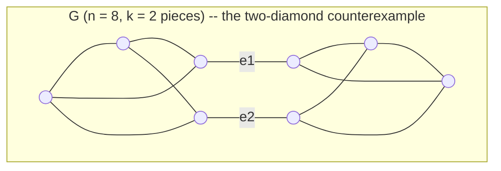

# Admissible bounds for the reduction search

The A* optimality guarantee is only as good as the heuristic's
admissibility. This document derives the bounds, states what is proved
and what is merely machine-certified, and marks the boundary of each.

Notation: `G` is a closed cubic multigraph on `n` vertices; the goal is
the theta graph (`n = 2`). Cost is `#6j + SUM_PENALTY * #sums`, with
`SUM_PENALTY = 10`.

## Lemma 0 (move accounting)

The three moves act on `n` and emit factors as follows:

| move | `n` | 6j | sums |
|---|---|---|---|
| bubble excision | `n - 2` | 0 | 0 |
| triangle contraction | `n - 2` | 1 | 0 |
| interchange (flip) | `n` | 1 | 1 |

**Generalized for the k=1 sector (v0.8.0).** Two more moves remove
vertices for free: loop excision (`n-2`, components unchanged) and
bridge cut (`n-2`, components **+1**). Writing `C` for the number of
components and `X` for the number of bridge cuts, the goal is one
irreducible diagram per component (`n = 2C_final`,
`C_final = C + X`), so the vertex-removing moves number

    (n - 2C - 2X) / 2

For a connected input reduced without bridge cuts (`C = 1`, `X = 0`)
this is the original `(n-2)/2`, which is why every benchmark cost is
unchanged. The rest of this section assumes that case.

Only bubbles and triangles change `n`, each by exactly 2, and the goal
has `n = 2`. So **every** complete reduction of `G` uses exactly
`(n-2)/2` vertex-removing moves, split into `B` bubbles and `T`
triangles, plus `S` flips:

    #6j  = T + S = (n-2)/2 - B + S
    cost = (n-2)/2 - B + (1 + SUM_PENALTY) * S

This identity reproduces all five benchmark costs exactly (tetrahedron
1, prism 2, K3,3 13, cube 14, Petersen 37), and it is what certifies
Petersen below.

**Consequence, and the origin of the v0.6.0 defect.** A lower bound on
cost requires an *upper* bound on `B`. The v0.6.0 heuristic used
`(n-2)/2` as its 6j term, which silently assumes `B = 0`. That is false
in general, so the heuristic was an over-estimate and A* was not
guaranteed optimal — on 58 of 80 reachable states with a computable
optimum (72.5%). See "The counterexamples".

## The shipped heuristic

    h(G) = 0  +  h_sum(G)

**Lemma 1 (summation bound). PROVEN.**

    h_sum(G) = SUM_PENALTY  if n > 2 and girth_lower(G) >= 4, else 0.

*Proof.* If `G` is not the goal and **no vertex-removing move applies**,
then every move out of `G` is an interchange. A complete reduction must
make at least one move, that move is a flip, and a flip emits one
summation. Hence `S >= 1` and `cost >= SUM_PENALTY`. If no move applies
at all, `G` is a dead end, `C*` is infinite, and any `h` is admissible.
∎

**The hypothesis must name every free move.** The move set is
`{bubble excision, loop excision, triangle contraction, interchange}`,
so the test is `bubbles()` **and** `excisable_loops()` **and**
`triangles()` all empty. The k=1 sector added loop excision, and until
`sum_bound` was taught about it the lemma's hypothesis was false at
exactly the tadpole states — charging a summation to a state with a free
vertex-removing move. Adding a free move without updating this test
makes `h` inadmissible in a single release; the two must land in the
same commit. See docs/K1_SECTOR.md, "The coupling".

Note what the proof does **not** use: the girth of `G`. Despite its
name, `girth_lower()` computes no cycle length — it is a
move-availability predicate, and the bound rests only on that.

### Degenerate states, and how the k=1 sector changed them

Before loop excision existed, a tadpole state had flips as its *only*
successors, so it genuinely owed a summation and the bonus was correct
(measured: an `n = 8` instance with `C* = 13 >= 10`). Loop excision
changed that -- such states now have a free vertex-removing move and owe
nothing, which is why `sum_bound` tests `excisable_loops()`.

The remaining degenerate case is the **dumbbell** (two tadpoles joined
by a bridge), where the loop-to-loop guard blocks excision. It is a dead
end today, so any `h` is admissible there; it becomes reducible when the
empty-diagram state model arrives with bridge cut.

**Trap for future work.** Neither `girth_lower()` nor `girth_cycle()` is
a girth. `girth_lower()` reports by bubble/triangle presence and is sound
*only* as the move-availability predicate proved above; `girth_cycle()`
skips self-loop edges outright. Both are wrong on a tadpole, whose true
girth is 1. Use **`Graph.true_girth()`** -- 1 if any self-loop, 2 if any
parallel pair, else the BFS cycle. The carving/branchwidth bound must.

**The 6j term is 0.** Trivially a valid lower bound. This is a
deliberate choice of a smaller proven bound over a larger conjectured
one, and it is *free*: with `SUM_PENALTY = 10` the summation term
dominates, and on every benchmark plus random cubic graphs out to
`n = 14` the decomposition bound below yields identical costs **and
identical expanded-node counts**. A term that cannot change a single
search decision does not justify an unproven admissibility claim.

`h_sum` is weak — it returns `SUM_PENALTY` whether the true answer is
one flip or five, so it bounds Petersen at `S >= 1` against a certified
`S = 3`. Strengthening it is Finding 3.

## Lemma 3 (the merge lemma)

The search dedups states by `Graph.canonical()`, an **anonymous**
topological certificate: j-labels are discarded, so two states with the
same shape are merged even when their labels differ. This is what makes
the state space small enough to search. It needs saying why it is sound.

**Lemma.** For the cost model `cost = #6j + SUM_PENALTY * #sums`, the
minimum remaining cost `C*(G)` depends only on the isomorphism class of
the underlying multigraph, not on the edge labels.

*Proof.* Each move's guard is a purely topological pattern — a pair of
parallel edges (bubble), a self-loop with a non-loop partner (loop
excision), a 1-line cut (bridge), a 3-cycle (triangle), an internal edge
with two distinct neighbours a side (flip). Each move's *cost*
contribution is a constant of its type (`d6`, `dsums`), independent of
which labels occupy the pattern. So a graph isomorphism carries any
reduction of `G` to a reduction of `G'` of identical cost, and `C*` is
an isomorphism invariant. Labels are carried along for the *algebra*
— which factors get emitted — but never for the *price*. ∎

**Machine-checked**: `tests/test_bounds.py` relabels corpus graphs at
random and asserts both the certificate and `C*` are unchanged.

### The boundary — where this fails

The lemma is a statement about **this** cost model, and it is exactly as
strong as the claim that price is label-independent. It would **fail**
for:

- **magnitude-aware cost models** — pricing a formula by the numerical
  size of its terms, or by cancellation, makes cost depend on the j
  values themselves;
- **sparsity- or sharing-aware cost models** — pricing by how many
  summation variables are *shared* between factors, or by reuse of a
  cached 6j, makes cost depend on which labels coincide;
- **evaluation-order models** that price the summation ranges (a sum
  over `x` costs `2x+1` terms), since the range depends on the labels.

Any of these breaks the merge, and with it the state-space collapse that
makes the search tractable. A cost model change is therefore also a
canonicalization change.

## The k-line anchor and the 2-cut decomposition (opt-in)

In the k-line calculus a k-line separation of a closed diagram costs
`max(0, k-3)` summation variables: **2- and 3-line cuts are free.** The
free case `k = 2` is what governs `B`, because a bubble is precisely the
minimal 2-line cut: the two vertices of a bubble meet the rest of the
diagram in exactly two edges. Bubbles are not an independent phenomenon
to be discounted by inspection — they are creatures of 2-edge-cuts, so
the discount should be *derived* from the cut structure.

Split `G` along a 2-edge-cut `{e1, e2}` into `G_A` and `G_B`, where each
side keeps its internal edges plus **one** new edge joining its two
dangling stubs — exactly the rewiring `excise_bubble` performs. Repeat
until no 2-edge-cut remains, giving 3-edge-connected pieces `P_1..P_k`.

Each split is size-preserving and lowers the running total by one, so

    Phi(G) := sum_i (n_i - 2)/2  =  (n-2)/2 - (k-1).

Equivalently the claim is `B <= (k-1) + S`.

### Why this is opt-in and not the default

The intended proof is a potential-function argument: `Phi(theta) = 0`,
so `Phi` bounds the 6j count provided

    Phi(G) <= Phi(G') + d6      for every move G -> G'.          (*)

Expanding `Phi = (n-2)/2 - (k-1)`, `(*)` reduces to three claims —
bubble: `k' = k-1` (holds by construction, a bubble *is* a size-2
piece); triangle: `k' <= k`; flip: `k' <= k+1`.

**`(*)` fails.** Measured over the corpus: **310 of 42,611 moves**
violate it. Every failure sits at a state carrying a **self-loop**
(a tadpole, which `excise_bubble` creates when a bubble's two external
stubs land on the same vertex) or a **bridge** (a 1-line cut). Such
pieces fall outside the decomposition argument and are scored 0, and a
move can then *relocate* the degeneracy between pieces: in the observed
case a flip took `[6 clean, 2 degenerate]` (`Phi = 2`) to
`[2 clean, 6 degenerate]` (`Phi = 0`), a drop of 2 for one 6j.

So the bound was **certified, not proven**:

- 0 violations of `Phi <= C*` over 80 states with computable optimum,
  tight on 54 — empirically admissible everywhere tested *against the
  move set of the day*;
- but its proof has a hole at degenerate states, which is exactly the
  epistemic position that let v0.6.0 ship broken (that bound also
  passed every test it had).

### Update (k=1 sector): it is now outright INADMISSIBLE

Loop excision removes two vertices **for free**, so `C*` fell below what
a bound counting `(n_i - 2)/2` per piece predicts. Re-running the corpus
after the move landed: **7 violations of `Phi <= C*`** over 75 states
with a computable optimum, every one at a state carrying an excisable
loop.

This is the strongest possible vindication of shipping the proven bound
instead. The decomposition was admissible on every state ever tested —
and one new free move broke it outright, in the very next release. **A
bound verified against a move set is only valid for that move set.**

It is retained, documented as unusable, as the foundation for the
carving/branchwidth work, where degenerate states get dissolved (bridge
cut, the empty-diagram model) rather than scored 0 — at which point it
can be re-derived and re-certified against the completed move set.

Rejected repairs, both by machine rather than by argument:

- **discount self-loop vertices** (`n_eff = n_i - 2 * loops`): *directly
  inadmissible*, 6 violations of `h <= C*`. This was the intuitively
  appealing fix.
- **whole-graph gate** (any degeneracy anywhere ⇒ 0): admissible, but
  still 96 step violations — a clean state can move to a degenerate one
  and collapse `Phi`.

`sixj_bound_decomposition` is retained because it is the foundation for
the carving/branchwidth bound of Finding 3, where the degenerate cases
must be handled properly rather than scored 0. It is not wired into
`heuristic`.

## Lemma 4 attempt — width invariants, and why they do not work

The roadmap carried one headline conjecture from the start: that the
minimum summation count is governed by a width invariant, as
tensor-network contraction complexity is. The k-line anchor makes the
inequality obvious to guess. Any reduction must at some point work
across a cut of the diagram; a k-line separation costs `max(0, k-3)`
summations; the minimum over orders of the widest such cut is the
**carving width**. Hence

    S >= cw(G) - 3.                                    (CONJECTURE)

It is false, and the two simplest benchmarks refute it.

### The refutation

Exact carving width by subset DP (`g(S) = min over splits of
max(g(A), g(B), cut(A), cut(B))`, O(3^n); validated against
hand-checkable cases -- `cw(C4) = cw(C6) = 2`, `cw(K1,3) = 3`,
`cw(K4) = 4`, `cw(theta) = 3`, and note `cw >= max degree` always,
since a leaf edge of the carving cuts `deg(v)`):

| graph | n | cw | cw - 3 | true S | |
|---|---|---|---|---|---|
| tetrahedron | 4 | 4 | 1 | **0** | REFUTED |
| prism | 6 | 4 | 1 | **0** | REFUTED |
| K3,3 | 6 | 4 | 1 | 1 | ok |
| cube Q3 | 8 | 4 | 1 | 1 | ok |
| Petersen | 10 | 5 | 2 | 3 | ok |
| random n=10 | 10 | 4 | 1 | **0** | REFUTED |

**Why it fails.** The rewrite calculus is strictly stronger than
generic tensor contraction. A triangle reduction collapses a
tetrahedron -- an object with a 4-line cut -- in ONE step, via Racah's
identity, without ever materializing a 4-line intermediate. Carving
width prices a cut that the 6j identity gets for free. Any width
invariant that counts cuts the moves can shortcut will over-charge.

### Two further reasons it could not have closed Finding 5

**It does not separate the cases.** `cw = 4` for tetrahedron, prism,
K3,3 AND cube, whose `S` are 0, 0, 1, 1. This is the same blindness
vertex treewidth showed (prism and K3,3 both have treewidth 3). What
DOES separate prism from K3,3 is girth -- the prism has triangles, K3,3
does not -- which the existing local `sum_bound` already captures for
free.

**It does not scale.** Exact carving width against the true `S` on
random cubic graphs:

| n | 8 | 10 | 12 | 14 |
|---|---|---|---|---|
| cw | 4 | 4 | 4 | 5 |
| true S | 1 | 0 | 1 | 3 |

`n` nearly doubles; `cw` moves by one. Even a perfect, admissible
width bound would fall further behind `S` as `n` grows -- which is the
`saved`-column decay the closure criterion forbids.

## What the search actually lacks: discrimination, not magnitude

The premise of Finding 5 was that `h` is too SMALL -- 20 against a true
cost of 135 at n = 30. That framing is wrong, and the measurement is
unambiguous.

**Adding a large, correct, scaling term buys exactly nothing.** Adding
`(n-2)/2` -- the 6j count, which grows linearly in n -- to the shipped
heuristic leaves expanded-node counts *byte-identical* at every size:

| n | 14 | 18 | 20 | 22 | 24 | 26 |
|---|---|---|---|---|---|---|
| shipped | 18 | 12 | 99 | 222 | 138 | 983 |
| + (n-2)/2 | 18 | 12 | 99 | 222 | 138 | 983 |

A* expands every state with `f < C*`. A term that is a function of
DEPTH -- and `(n-2)/2` is exactly that, since `n` falls uniformly --
shifts `f` equally for every state on the frontier and separates none
of them. The same objection applies to any width invariant, which
changes slowly along a reduction.

**What a heuristic must do is tell same-depth states apart.** Measured
over all 97 reachable states with `n = 8` and a computable optimum:

| quantity | distinct values | violations | distribution |
|---|---|---|---|
| true `C*` | 6 | -- | `{0:58, 1:23, 2:8, 3:1, 13:4, 14:3}` |
| shipped `h` | **2** | 0 | `{0:93, 10:4}` |
| decomposition + sum | **6** | 5 | `{0:73, 1:13, 2:5, 3:2, 10:2, 13:2}` |

The shipped bound returns 0 for 93 states whose true costs are 0, 1, 2
and 3: it cannot tell a finished diagram from one needing three more
6j symbols. And the variation it misses is in the **6j count**, not the
summation count -- the opposite of where the roadmap was looking.

The 2-cut decomposition bound already resolves exactly the right number
of classes, six. It is simply inadmissible (5 of 97 here, 8 over the
wider corpus), because the free moves added by the k=1 sector -- loop
excision and bridge cut -- remove two vertices at no 6j cost and drop
`C*` below `(n_i - 2)/2` per piece.

### The redirect, with its accounting

The bound to build is therefore not a width bound. It is the
DISCRIMINATING 6j term: the decomposition bound, re-derived so that it
is admissible under the completed move set. Generalizing Lemma 0 to all
five moves, with `B` bubbles, `L` loop excisions, `X` bridge cuts, `T`
triangles, `S` flips, `C` starting components:

    B + L + X + T = n/2 - C - X
    #6j = T + S   = n/2 - C - B - L - 2X + S

so a lower bound on the 6j count needs an upper bound on `B + L + 2X`.
The current decomposition bounds `B` alone, via 2-edge-cuts, and scores
self-loop and bridge pieces 0 as a carve-out. The principled version
extends the same k-line logic DOWN to `k = 1`: bridges and tadpoles are
1-cuts, they are exactly what `L` and `X` consume, and they should be
split on rather than excluded.

## Lemma 5 — the discriminating bound exists, is admissible, and still buys nothing

Lemma 4 identified the gap as discrimination rather than magnitude, and
named the fix: re-derive the decomposition bound so it is admissible
under the completed move set. That was done. All three candidates were
measured against `M(G)`, the minimum 6j count over ALL complete
reductions (uniform cost on `d6` alone, so `M <= C*` and any admissible
6j term must sit below it).

| candidate | violations vs M | distinct h |
|---|---|---|
| shipped (6j term = 0) | 0 | **2** |
| decomposition, ungated | **8** | 7 |
| decomposition, gated on self-loop/bridge | **0** | **7** |
| k=1-extended split (below) | **17** | 7 |

(True `C*` takes 6 distinct values over the same 135 states.)

**The principled fix made it worse.** Extending the decomposition split
DOWN to 1-cuts -- splitting on bridges and tadpoles rather than carving
them out, mirroring `cut_bridge` by capping each side's endpoint --
takes the violations from 8 to **17**. The k-line logic that works at
`k = 2` does not transfer to `k = 1`: capping over-splits, because a
bridge cut consumes two vertices AND raises the component count, which
the per-piece `(n_i - 2)/2` accounting double-counts.

**Gating works.** All 8 ungated violations sit at states carrying BOTH
a self-loop and a bridge. Excluding those gives `sixj_bound_gated`:
0 violations against `M` and against `C*` over the corpus, and 7
distinct values -- more resolution than true `C*` itself has.

**And it changes nothing.** Expanded-node counts with
`gated + sum_bound` are identical to the shipped heuristic at every
size measured:

| n | 16 | 20 | 22 | 24 | 26 | 30 |
|---|---|---|---|---|---|---|
| shipped | 20 | 99 | 222 | 138 | 983 | 2010 |
| gated | 20 | 99 | 222 | 138 | 983 | 2010 |

### Why: granularity, not resolution

The census behind Lemma 4 said true `C*` at `n = 8` distributes as
`{0:58, 1:23, 2:8, 3:1, 13:4, 14:3}`. The two clusters are "needs no
further flip" (0..3) and "needs one" (13, 14). The gap BETWEEN clusters
is `SUM_PENALTY = 10`; the spread WITHIN the low cluster is 0..3, and it
is entirely 6j count.

The shipped bound's two values, 0 and 10, already separate the clusters
-- the only axis the cost model prices at a scale that can reorder the
queue. The decomposition bound adds resolution *inside* a cluster,
below the step size, and finer resolution below the step size changes
no decision.

So the sequence is now closed at three levels:

1. **magnitude** does not help (Lemma 4: adding `(n-2)/2` changes
   nothing);
2. **width** cannot supply the bound anyway (Lemma 4: `S >= cw-3` is
   false);
3. **6j-count discrimination** helps neither, even when admissible and
   finer than `C*` itself -- it resolves below the granularity that
   matters.

### What the open problem actually is, now precisely posed

The discriminating quantity must be a per-state lower bound on the
NUMBER OF FUTURE FLIPS, resolving `S >= 2` from `S >= 3` and so on, at
the 10-unit scale. The shipped `sum_bound` gives `S >= 1` and nothing
more; `true_girth - 3` was measured at 0-3% (Finding 5); width
invariants are refuted (Lemma 4). No admissible per-state flip-count
bound beyond `S >= 1` is currently known.

That is the open problem, and it is now stated in the form a solution
must take -- which it was not before this session.

### The creation lemma, measured

For the record, since the next attempt will need it. Worst-case
violation of the induction step `Phi(G) <= Phi(G') + d6`, by move type,
over the corpus:

| move | emits 6j | worst gap |
|---|---|---|
| triangle | yes | +1 |
| flip | yes | +2 |
| bubble | no | +2 |
| bridge | no | +2 |
| loop | no | +2 |

A gap on a move that emits no 6j cannot be amortized against anything,
which is why the potential-function proof fails and why the gated bound
is certified-by-corpus rather than proved.

## Lemma 6 — a bound can be strictly better and strictly worse at once

Rung one (`S >= 1` by reducibility, v0.10.0) tripled the `saved` column
and still decayed, so the ladder continued to rung two:

    S >= 2  iff  no reduction of g uses exactly one flip

**Stated correctly, which matters.** A one-flip reduction is
`(free/triangle)* -> flip -> (free/triangle)* -> terminal`, so one flip
suffices iff SOME state reachable from `g` without a flip has SOME
flip-child that is flip-free-reducible. Quantifying only over `g`'s own
flip children would be unsound: it would miss every reduction that
takes a free move first.

Both forms were built and measured. Both are admissible -- 0 violations
against `C*` over the corpus -- and both cut real nodes. Both lose.

| form | node cut (n=16..30) | wall clock |
|---|---|---|
| correct (over `FreeReach`) | 12-35% | **10x - 23x SLOWER** |
| cheap (only where no free move applies, so `FreeReach = {g}`) | 4-19% | **1.3x - 6x SLOWER** |

### Why, and why it generalizes

Evaluating the bound costs more than the search it saves. Rung two asks
`flip_free_reducible` of roughly `4|E|` flip children per node, and each
such call runs a small DFS whose every step computes a nauty
certificate. At n = 26 that is ~150 children per node against a search
that averages well under a millisecond per expansion.

So: **an admissible bound can be strictly better AS A BOUND and
strictly worse AS AN ALGORITHM.** Rung two dominates rung one on every
node-count metric -- more firings, more pruning, same costs -- and is
unusable. Nothing in the node counts reveals this; only wall clock
does. That is why the closure criterion is measured with
`scripts/headroom.py` and not with expansion counts alone, and why the
brief for this rung insisted on the point in advance.

The corollary for what comes next: any candidate whose evaluation cost
scales with the move set is suspect. The one that does not is the
**endgame pattern database** -- exact `C*` memoized by canonical
certificate for every topology up to n ~ 10-12, an O(1) dictionary
lookup per node with no search inside the heuristic at all. Lemma 6 is
the argument for it.

### Status

Not shipped. `scripts/rung2_probe.py` keeps both forms and their
numbers reproducible. The shipped heuristic remains rung one.

## Petersen, certified

`optimal_cost` runs uniform-cost search (`h = 0`) over the **blind**
move set: no heuristic, no move restriction, so the answer rests on no
claim in this document except the cost model itself.

    C*(Petersen) = 37

By Lemma 0, `cost = (n-2)/2 - B + 11*S = 4 - B + 11*S`. A two-summation
reduction would cost at most `4 + 22 = 26 < 37`. Therefore **`S = 2` is
impossible: Petersen's minimum is three summations**, and the shipped
`7` 6j / `3` sum formula is optimal over the full move set — not merely
within the cycle-targeted class. Confirmed three ways: uniform-cost
(37), blind-move A* (37; 7 6j, 3 sums; 18 expansions), shipped targeted
A* (37; 11 expansions).

## The counterexamples

Both are pinned as named regression tests. Neither is producible by
`random_cubic`, which rejects parallel edges — which is why no test ever
surfaced them.

**1. Bubble counterexample** (`n = 4`, a multigraph state):

    (1,2,a) (1,2,b)  (3,4,c) (3,4,d)  (1,3,e) (2,4,f)

Excising bubble `(1,2)` joins the two external stubs into `(3,4,e)`,
landing directly on theta. `C* = 0`, but `h_old = (4-2)//2 = 1`.
Decomposition: two pieces of size 2, `Phi = 0`. Correct.

**2. Two-diamond counterexample** (`n = 8`, a *simple* graph — so
restricting attention to bubble-free simple states does not rescue the
old bound):

    two K4-minus-an-edge blocks joined by a 2-edge-cut

Contracting a diamond's triangle *births* a parallel pair; excising it
drops `n` by 4 for a single 6j. `C* = 2`, but `h_old = (8-2)//2 = 3`.
Decomposition: two pieces of size 4, `Phi = 1 + 1 = 2`. Correct, tight,
and diagrammed above.

## Certification record

Measured over the reachable-state corpus (BFS over the real blind move
set from the five benchmarks and random cubic `n = 8, 10, 12` seeds;
multigraph, self-loop and bridge states included), by
`scripts/certify_bounds.py`:

- Benchmarks re-certified against `h = 0` uniform-cost search over the
  blind move set: tetrahedron 1, prism 2, K3,3 13, cube 14,
  Petersen 37 — all equal to the v0.6.0 published costs. **The
  guarantee was void; the published results were nonetheless correct.**
- `h_old`: 58 of 80 states with computable `C*` violate `h <= C*`
  (72.5%).
- Shipped `h`: 0 admissibility violations, 0 step violations.
- Opt-in decomposition: 0 admissibility violations, tight on 54; 310
  step violations, all at degenerate states, 0 at clean states.
