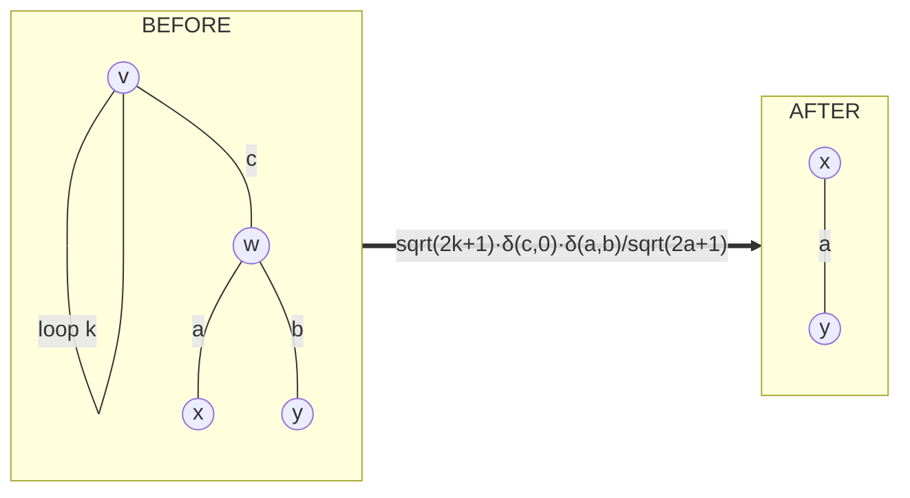

# The k=1 sector

Self-loops and bridges are not edge cases to be scored around. They are
the `k = 1` case of the separation calculus, and the fix is physics.

The k-line anchor (docs/BOUNDS.md) already covers `k = 2` — free, a
delta — and `k = 3` — free, a 6j factorization. `k = 1` had never been
needed, but it is equally exact: **a closed diagram is a rotational
scalar, so any single line crossing a separation must carry `j = 0`.**

## Lemma K1a (the tadpole weight)

Closing two legs of a vertex forces its third edge to zero:

    sum_m (-1)^(k-m) 3j(k k jc; m, -m, mc) = sqrt(2k+1) d(jc,0) d(mc,0)

The `(-1)^(k-m)` is the oracle's per-edge metric factor, so this is the
identity in *this* project's conventions, not a textbook one.

**Verified** (`tests/test_oracle.py`): the dumbbell of two tadpoles
evaluates to `sqrt(2k+1)*sqrt(2f+1)` on six `(k,f)` pairs including
half-integers, sign included, and vanishes identically at `jc != 0` —
exhibiting the `j = 0` forcing directly.

## Lemma K1b (the cap rule)

A vertex carrying a `j = 0` leg is removed, and its other two edges
merge:

    3j(ja jb 0; ma, mb, 0) = d(ja,jb) d(ma,-mb) (-1)^(ja-ma)/sqrt(2ja+1)

**Verified**: a tetrahedron with one edge set to `j = 0` caps at both
ends and collapses to a theta. Measured ratio over five labelings,
half-integers included:

    tetrahedron(j1,j1,0,j4,j4,j6) / theta(j1,j4,j6)
        = 1/sqrt((2j1+1)(2j4+1))

exactly — one `1/sqrt(2j+1)` per cap, phase `+1` in these orientations.

## The move: loop excision

The two lemmas are **fused into a single move**, because K1a alone would
leave `c` dangling and the graph must stay closed and cubic between
moves:

`v` and `w` both go, `w`'s other two edges merge, `n` drops by 2 for
**no 6j and no summation**.

**Guard.** `w` must be distinct from `v` and carry no loop of its own.
The loop-to-loop case is the **dumbbell**, an irreducible `k = 1`
terminal: capping it leaves a bare circle with no vertices, which needs
the empty-diagram state model. Excluded rather than mishandled — see
"Not yet handled".

## The coupling (why this could not ship alone)

Loop excision is a **free** move, and Lemma 1 of docs/BOUNDS.md reads

> no bubble and no triangle ⇒ every move is a flip ⇒ `S >= 1`

which the new move **falsifies**: a tadpole state has a free
vertex-removing move and owes no summation. `sum_bound` therefore tests
`excisable_loops()` as well, in the same commit. Shipping the move
without the bound change would have made `h` inadmissible at exactly the
states the move was added to handle — repeating the v0.6.0 mistake
inside one release.

**Any future free move must be added to `sum_bound` in the same commit.**

## What this fixed

The `theta-with-handle` diagram — two bubbles whose external legs each
land on a common vertex — used to reduce to the dumbbell and be accepted
by the old `is_goal` test (`n <= 2`), terminating at cost 0 with two
deltas and **every `j = 0` constraint dropped**. Silent incorrectness on
valid input.

It now reduces `bubble -> loop` to a true theta, emitting

    delta(a,b)/(2*a+1)
    loopw(c)*delta(e,0)*delta(f,g)/sqrt(2*f+1)

with the `j = 0` forcing present in the formula.

## The flip guard this forced

Making loop states reachable-and-not-silently-accepted exposed that
`interchanges` was unguarded against degenerate patterns. The flip phase
was determined by constrained fit against `wigner_9j` on a **generic**
patch (v0.4.0): `e = (u,v)`, `P` a neighbour of `u`, `Q` a neighbour of
`v`, all distinct. A self-loop at `u` makes `P == u`, which that fit
never covered.

Unguarded, the dumbbell — an irreducible terminal — "reduced" at cost 11
through algebra that has never been validated there. Both
`interchanges` and `targeted_interchanges` now skip loop legs.

## One honest girth

`true_girth()` — 1 if any self-loop, 2 if any parallel pair, else the
BFS cycle. The other two are deliberately left alone, because neither is
a girth and both are correct at their actual jobs:

- `girth_lower()` reports by bubble/triangle presence and never computes
  a cycle. It is the move-availability predicate Lemma 1 rests on.
- `girth_cycle()` skips self-loop edges outright, so it returns a
  2-cycle on a graph whose true girth is 1.

Reach for `true_girth()`; the carving/branchwidth bound must.

## The exact layer (v0.7.1)

`excise_loop_exact` completes the move. The canonical patch — `v` slots
`(k,k,c)` with the loop's tail first and `c: v->w`, `w` slots `(c,a,b)`
with `a` and `b` both tailed at `w` — excises with factor

    sqrt(2k+1) / sqrt(2a+1) * delta(c,0) * delta(a,b)

and phase **exactly +1**. That was measured, not assumed: the ratio
`before / (factor * after)` is `+1.0` on every labeling of the canonical
family.

The general case normalizes by slot permutations (`(-1)^triad`) and
orientation flips (`(-1)^(2j)`), exactly as `excise_bubble_exact` does.
The loop needs no special orientation handling: the oracle fixes its
tail/head by **slot order**, so any reordering preserving the relative
order of the two `k` slots preserves the orientation.

**Verified**: across all 576 slot-permutation x orientation
configurations and 2880 comparisons, **0 mismatches** against the
oracle. End-to-end on `theta-with-handle`, `solve_exact` matches
brute-force magnetic summation on **256 labelings (49 nonzero), 0
mismatches**, and vanishes identically at `j_e != 0`.

The expression grew three fields: `zeros` (labels forced to `j = 0`),
`sqrt_num` and `sqrt_den` (labels contributing `sqrt(2j+1)` and its
inverse).

### A pre-existing evaluator bug this exposed

Every emitted identity — 3j orthogonality for the bubble, Racah for the
triangle, K1a/K1b for the loop — is derived **assuming the source
vertex's triad exists**; and the final theta is folded into `theta_sign`
as a `+-1` phase presuming the same. Where a triad fails the diagram is
zero, but the emitted factors are not, so `evaluate_expr` returned `+-1`
on vanishing diagrams.

Measured on the **existing bubble fixture, with no k=1 move involved**:
**186 of 729 labelings wrong**. The shipped tests happened to pick valid
labelings. `replay` now records the input triads and the final theta's
labels, and `evaluate_expr` enforces the 3j conditions (integral triad
sum plus triangle inequality) — the theta check inside the summation,
since its labels may be summation variables. The same sweep is now
**0 of 729**.

## Bridge cut and the dumbbell terminal (v0.8.0)

### Bridge cut

A bridge is a 1-line cut, so its edge carries `j = 0` and the cap rule
K1b applies at **both** ends:

    delta(e,0) * delta(a,b) * delta(c,d) / (sqrt(2a+1) * sqrt(2c+1))

phase exactly **+1** canonically (`e: u->w`, `u` slots `(a,b,e)` with
`a,b` tailed at `u`, `w` slots `(c,d,e)` with `c,d` tailed at `w`).
Measured, not assumed.

It **splits** the diagram into two independent closed diagrams, which is
why it needed the state model below.

**Verified**: 0 mismatches over 4608 comparisons spanning every slot
permutation and orientation of both endpoints.

### The multi-component state model

States stopped being connected. Three things generalized together:

- `is_goal` is now `is_terminal()` — **every component** irreducible.
  Previously `is_theta()`, which was correct but assumed one diagram;
  two disjoint thetas were a dead end (`n = 4`, no move applicable).
- Lemma 0's accounting becomes `(n - 2C - 2X)/2` for `C` components and
  `X` bridge cuts (docs/BOUNDS.md). For a connected input reduced
  without bridge cuts this is the original `(n-2)/2`, which is why
  every benchmark cost is unchanged.
- `replay` finalizes each component separately, so a reduction ends in a
  **set** of irreducible diagrams; `expr["theta"]` is a list.

### The dumbbell terminal

The loop-to-loop case — two tadpoles joined by a bridge — is
irreducible: capping either end would merge a self-loop's two ends into
a **bare circle with no vertices**. Rather than make the empty diagram a
first-class state, the dumbbell terminates with its own factor:

    sqrt(2k+1) * sqrt(2f+1) * delta(c,0)

phase +1 canonically. Both loop excision and bridge cut are guarded off
this configuration, so it is reached rather than mangled.

**Verified**: 0 mismatches over 162 comparisons across slot
permutations, bridge orientation and labelings; and `solve_exact` on a
bare dumbbell reproduces the oracle exactly (it is a zero-move terminal
whose entire value is the factor above).

### The coupling, third time

Bridge cut is a **free** move, so `sum_bound` tests
`cuttable_bridges()` alongside `bubbles()`, `triangles()` and
`excisable_loops()` — in the same commit, as ever.

## What the k=1 sector cost the opt-in bound

Re-certified after the move set was completed: the decomposition bound
now has **8** admissibility violations (7 after loop excision, 0 before
the sector). The shipped heuristic remains at **0** violations and **0**
step violations over 46,005 moves.

Worth noting what the sector did to the corpus itself: reachable states
grew 786 -> 910, and states with a **computable** optimum grew 75 -> 135,
because configurations that used to be dead ends now terminate.

## Not yet handled

- **The bare circle (empty diagram)** is deliberately NOT a state. The
  one configuration that would produce it -- capping a tadpole -- is the
  dumbbell, handled as a terminal instead. If a future move ever needs
  an empty component, this is the decision to revisit.
- **The opt-in decomposition bound is inadmissible** under the completed
  move set (8 violations). Re-deriving it now that degenerate states are
  dissolved is the entry point for the carving/branchwidth work --
  docs/BOUNDS.md and docs/NEXT_STEPS.md.
