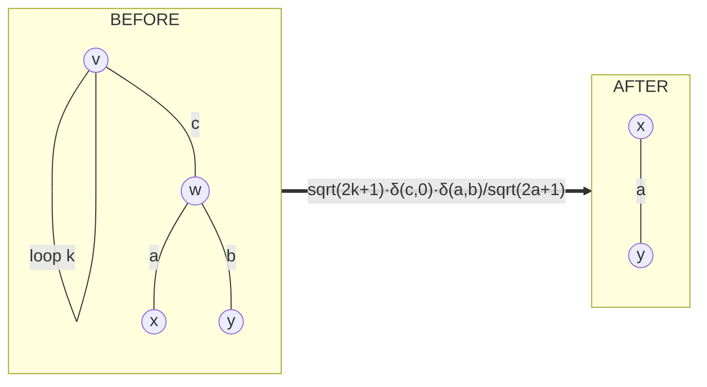

# The k=1 sector

Self-loops and bridges are not edge cases to be scored around. They are
the `k = 1` case of the separation calculus, and the fix is physics.

The k-line anchor (docs/BOUNDS.md) already covers `k = 2` — free, a
delta — and `k = 3` — free, a 6j factorization. `k = 1` had never been
needed, but it is equally exact: **a closed diagram is a rotational
scalar, so any single line crossing a separation must carry `j = 0`.**

## Lemma K1a (the tadpole weight)

Closing two legs of a vertex forces its third edge to zero:

    sum_m (-1)^(k-m) 3j(k k jc; m, -m, mc) = sqrt(2k+1) d(jc,0) d(mc,0)

The `(-1)^(k-m)` is the oracle's per-edge metric factor, so this is the
identity in *this* project's conventions, not a textbook one.

**Verified** (`tests/test_oracle.py`): the dumbbell of two tadpoles
evaluates to `sqrt(2k+1)*sqrt(2f+1)` on six `(k,f)` pairs including
half-integers, sign included, and vanishes identically at `jc != 0` —
exhibiting the `j = 0` forcing directly.

## Lemma K1b (the cap rule)

A vertex carrying a `j = 0` leg is removed, and its other two edges
merge:

    3j(ja jb 0; ma, mb, 0) = d(ja,jb) d(ma,-mb) (-1)^(ja-ma)/sqrt(2ja+1)

**Verified**: a tetrahedron with one edge set to `j = 0` caps at both
ends and collapses to a theta. Measured ratio over five labelings,
half-integers included:

    tetrahedron(j1,j1,0,j4,j4,j6) / theta(j1,j4,j6)
        = 1/sqrt((2j1+1)(2j4+1))

exactly — one `1/sqrt(2j+1)` per cap, phase `+1` in these orientations.

## The move: loop excision

The two lemmas are **fused into a single move**, because K1a alone would
leave `c` dangling and the graph must stay closed and cubic between
moves:

`v` and `w` both go, `w`'s other two edges merge, `n` drops by 2 for
**no 6j and no summation**.

**Guard.** `w` must be distinct from `v` and carry no loop of its own.
The loop-to-loop case is the **dumbbell**, an irreducible `k = 1`
terminal: capping it leaves a bare circle with no vertices, which needs
the empty-diagram state model. Excluded rather than mishandled — see
"Not yet handled".

## The coupling (why this could not ship alone)

Loop excision is a **free** move, and Lemma 1 of docs/BOUNDS.md reads

> no bubble and no triangle ⇒ every move is a flip ⇒ `S >= 1`

which the new move **falsifies**: a tadpole state has a free
vertex-removing move and owes no summation. `sum_bound` therefore tests
`excisable_loops()` as well, in the same commit. Shipping the move
without the bound change would have made `h` inadmissible at exactly the
states the move was added to handle — repeating the v0.6.0 mistake
inside one release.

**Any future free move must be added to `sum_bound` in the same commit.**

## What this fixed

The `theta-with-handle` diagram — two bubbles whose external legs each
land on a common vertex — used to reduce to the dumbbell and be accepted
by the old `is_goal` test (`n <= 2`), terminating at cost 0 with two
deltas and **every `j = 0` constraint dropped**. Silent incorrectness on
valid input.

It now reduces `bubble -> loop` to a true theta, emitting

    delta(a,b)/(2*a+1)
    loopw(c)*delta(e,0)*delta(f,g)/sqrt(2*f+1)

with the `j = 0` forcing present in the formula.

## The flip guard this forced

Making loop states reachable-and-not-silently-accepted exposed that
`interchanges` was unguarded against degenerate patterns. The flip phase
was determined by constrained fit against `wigner_9j` on a **generic**
patch (v0.4.0): `e = (u,v)`, `P` a neighbour of `u`, `Q` a neighbour of
`v`, all distinct. A self-loop at `u` makes `P == u`, which that fit
never covered.

Unguarded, the dumbbell — an irreducible terminal — "reduced" at cost 11
through algebra that has never been validated there. Both
`interchanges` and `targeted_interchanges` now skip loop legs.

## One honest girth

`true_girth()` — 1 if any self-loop, 2 if any parallel pair, else the
BFS cycle. The other two are deliberately left alone, because neither is
a girth and both are correct at their actual jobs:

- `girth_lower()` reports by bubble/triangle presence and never computes
  a cycle. It is the move-availability predicate Lemma 1 rests on.
- `girth_cycle()` skips self-loop edges outright, so it returns a
  2-cycle on a graph whose true girth is 1.

Reach for `true_girth()`; the carving/branchwidth bound must.

## Not yet handled

- **Bridge cut.** A bridge forces `j = 0` and caps both ends, splitting
  the diagram into two independent closed pieces — which today's
  single-graph state model cannot represent. Two disjoint thetas are
  currently a dead end: `is_goal` is false (`n = 4`), no move applies.
  Needs `is_goal` generalized to "every component is a theta", Lemma 0's
  accounting to `(n - 2C)/2`, and the bounds taken per component. Next
  PR.
- **The dumbbell terminal**, for the same reason (bare circle = empty
  diagram).
- **The exact layer.** Loop excision has no oriented counterpart yet, so
  `solve_exact` still meets a non-theta and raises. Pinned as an xfail
  in `tests/test_k1_sector.py`; lands with the phase derivation.
