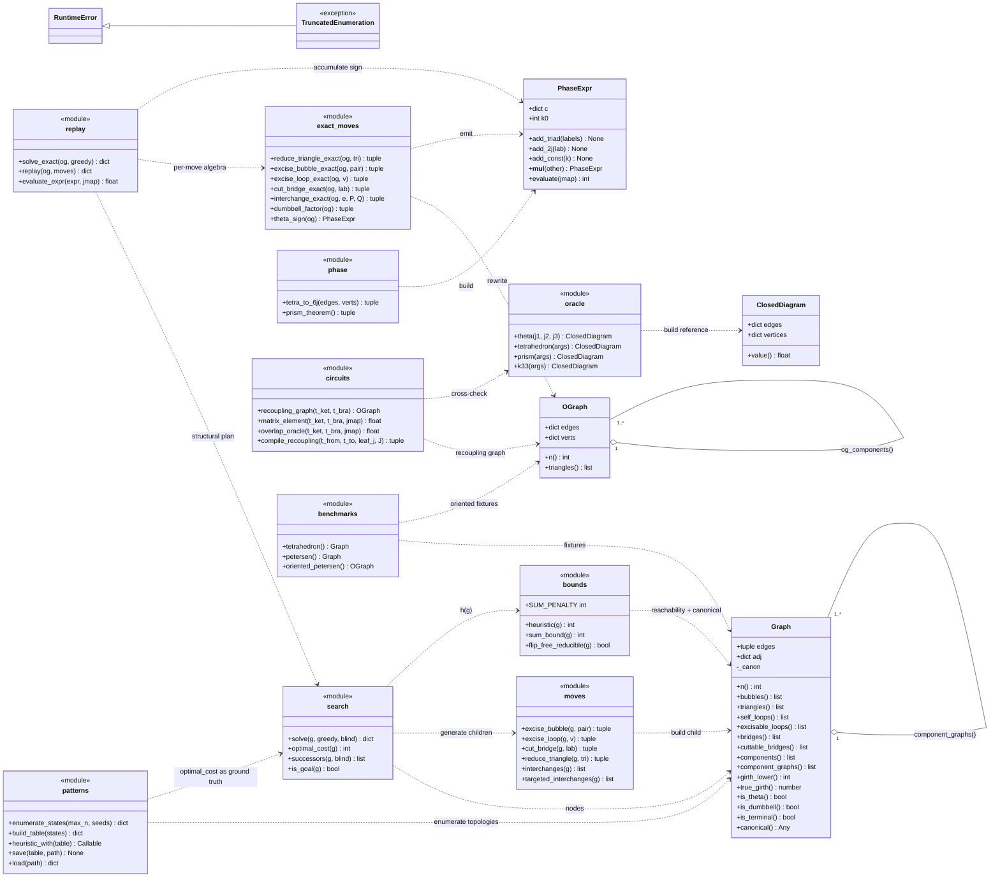
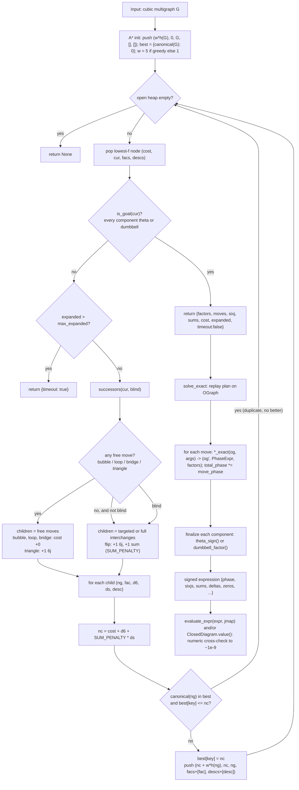
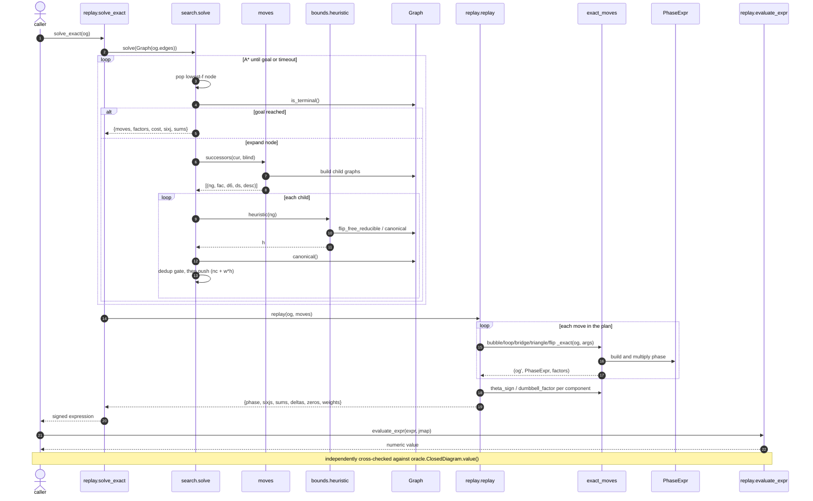
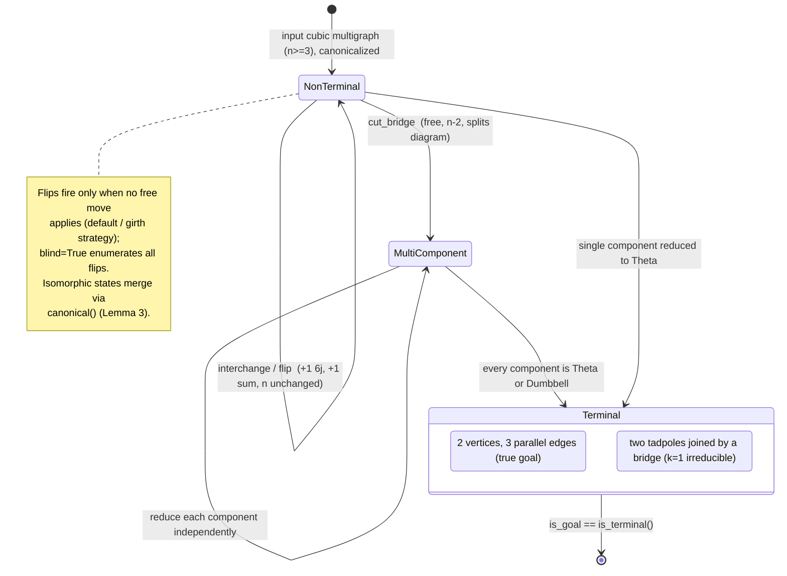

# UML diagram set (v0.12.0)

Core structural views of the `yutsis` system, derived from the source
at `src/yutsis/` and rendered with Mermaid (GitHub renders these inline).
Four diagrams: **class**, **process/activity**, **sequence**, and
**state**.

A note on altitude: `yutsis` is a functional Python package, not a deep
class hierarchy. Only five real types carry state
(`Graph`, `OGraph`, `PhaseExpr`, `ClosedDiagram`, and the
`TruncatedEnumeration` exception); the reduction logic lives in
module-level functions. The class diagram therefore shows those five
types with their members, plus the collaborating modules as
`<<module>>` participants so the dependency structure is visible.

Two layers run in parallel and should be read together:

- **Structural layer** (`Graph`, `search`, `moves`, `bounds`,
  `patterns`) — searches the rewrite space for the *cheapest plan*. It
  never touches physics; a move is a topological pattern with a constant
  cost.
- **Exact/algebra layer** (`OGraph`, `replay`, `exact_moves`, `phase`,
  `oracle`, `circuits`) — *replays* that plan on the oriented diagram to
  emit signed algebra (6j symbols, phases, deltas), then checks it
  numerically.

---

## 1. Class diagram

**Reading it.** `Graph` is the search node — a bare cubic multigraph
whose methods are all topological queries (pattern guards) plus
`canonical()` for deduplication. `component_graphs()` returns `Graph`
instances (a graph is a set of components), which is why bridge cutting
can split one node into several. `OGraph` is the oriented twin used only
in the exact layer; `PhaseExpr` is the running sign, multiplied move by
move. `ClosedDiagram` is the independent brute-force oracle.

---

## 2. Process / activity diagram

The full pipeline: search for a plan, then (optionally) replay it into
signed algebra and verify.

**Key invariants.** Free moves (bubble/loop/bridge) cost nothing and
drop `n` by 2; a triangle costs one 6j; a flip costs one 6j **and** one
summation (`SUM_PENALTY = 10`). Flips are only generated when no free
move applies (the girth strategy) unless `blind=True`, which enumerates
the full flip set for optimality claims over the unrestricted move
class. The `best` map keyed by `canonical()` is the deduplication gate:
an isomorphic topology already reached at equal-or-lower cost is
dropped (sound by Lemma 3 — cost is an isomorphism invariant).

---

## 3. Sequence diagram — `solve_exact` end to end

The exact path wraps the structural `solve`, then replays and verifies.

The two-layer split is visible: everything left of `replay.replay` is
pure topology (no j-labels, no signs); everything right of it is exact
algebra keyed off the plan `solve` produced.

---

## 4. State diagram — a diagram's reduction lifecycle

A search node is a `Graph` (possibly multi-component). Moves transition
it toward a terminal; the goal is a property of **every** component.

**The k=1 subtlety.** `cut_bridge` and `excise_loop` are the k=1 sector:
a single line crossing a cut must carry `j = 0`. A bridge cut is the
only transition that raises the component count, so `MultiComponent` is
reachable only through it. A `Dumbbell` (two tadpoles joined by a
bridge) is irreducible — capping it would leave a bare circle — so it is
an accepting terminal alongside the `Theta`. `is_goal` accepts iff every
component is one of the two.

---

## Regenerating / trusting these

These diagrams are hand-authored from the code at v0.12.0, not
machine-generated, so they can drift. The load-bearing facts to
re-check against source after any structural change:

- move cost signature `(graph, factor, d6, ds, desc)` and the cost
  formula `nc = cost + d6 + SUM_PENALTY*ds` (`search.solve`)
- terminal definition `is_terminal = all(theta or dumbbell)`
  (`graph.py`, `search.is_goal`)
- the flip-gating condition (`search.successors`)
- the five stateful types and their members (`graph`, `state`, `phase`,
  `oracle`, `patterns`)
